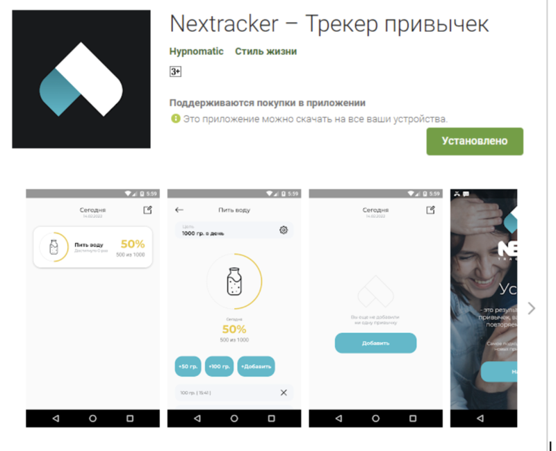

# Кейс «Протестировать приложение»

## Вам предлагается протестировать Nextracker — приложение для закрепления полезных привычек.

[Ссылка для IOS](https://apps.apple.com/ru/app/nextracker-%D1%82%D1%80%D0%B5%D0%BA%D0%B5%D1%80-%D0%BF%D1%80%D0%B8%D0%B2%D1%8B%D1%87%D0%B5%D0%BA/id1609916479)  
[Ссылка для андроида](https://play.google.com/store/apps/details?id=com.alef.nextracker&pli=1)

Задание 1. Сделайте чек-лист для проверки приложения. Платные функции покупать не нужно, но нужно отразить их в проверках.

Задание 2. Выберите конкретную привычку и распишите для нее тест-кейсы.

Задание 3. Если в ходе работы вы обнаружите какие-то баги, оформите их.