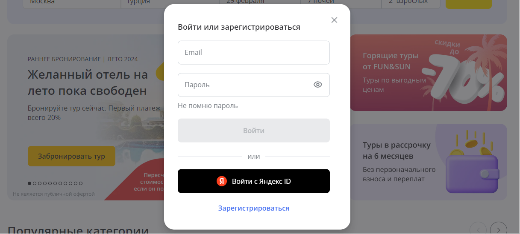
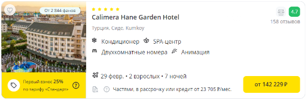

# Конкурс для тестировщиков от компании Fun&Sun

Fun&Sun - одна из ведущих туристических компаний России, включающая туроператора и сеть турагентств. Компания была основана в 2009 году на базе российских туроператоров VKO Group и Mostravel.
Более подробная информация: disk.yandex.ru...iuRxR6I8kA

**Задание 1.** Протестируйте форму авторизации на сайте https://fstravel.com/.
Опишите необходимые проверки для подтверждения работоспособности формы.

**Задание 2.** Представим, что в вашем доме в лифте сломалась кнопка вызова первого этажа. Заведите данный баг.

**Задание 3.** Перейдите на сайт https://fstravel.com/, нажмите на кнопку “найти”, изучите карточки отелей. Пропишите ответы по списку ниже. Приложите скрины в подтверждение вашим ответам.

Цвет кнопки с ценой
Название шрифта “2 взрослых”
Размер шрифта названия отеля
Цвет кнопки с ценой при наведении
Цвет сердечка у тура, добавленного в избранное
Расстояние между звездочками в звездности отеля

**Задание 4.** Перейдите на сайт https://fstravel.com/, нажмите на кнопку “найти”.
Ответьте, пожалуйста, на вопросы:

Какой запрос отправляется при добавлении тура в список избранное?
Какой URL этого запроса?
Напишите метод запроса.
Что содержится в запросе?
Что приходит в ответе?
Какой код ответа?